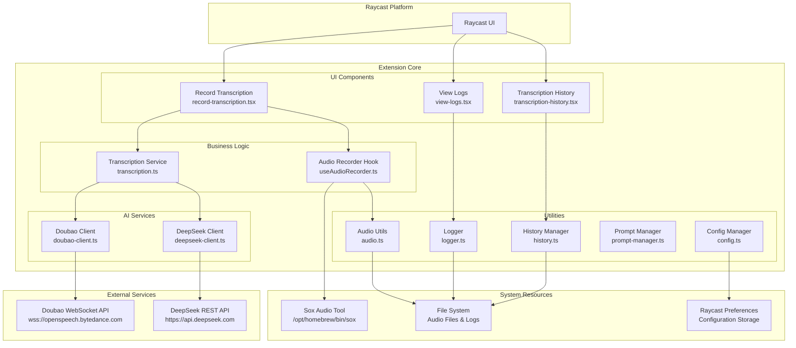
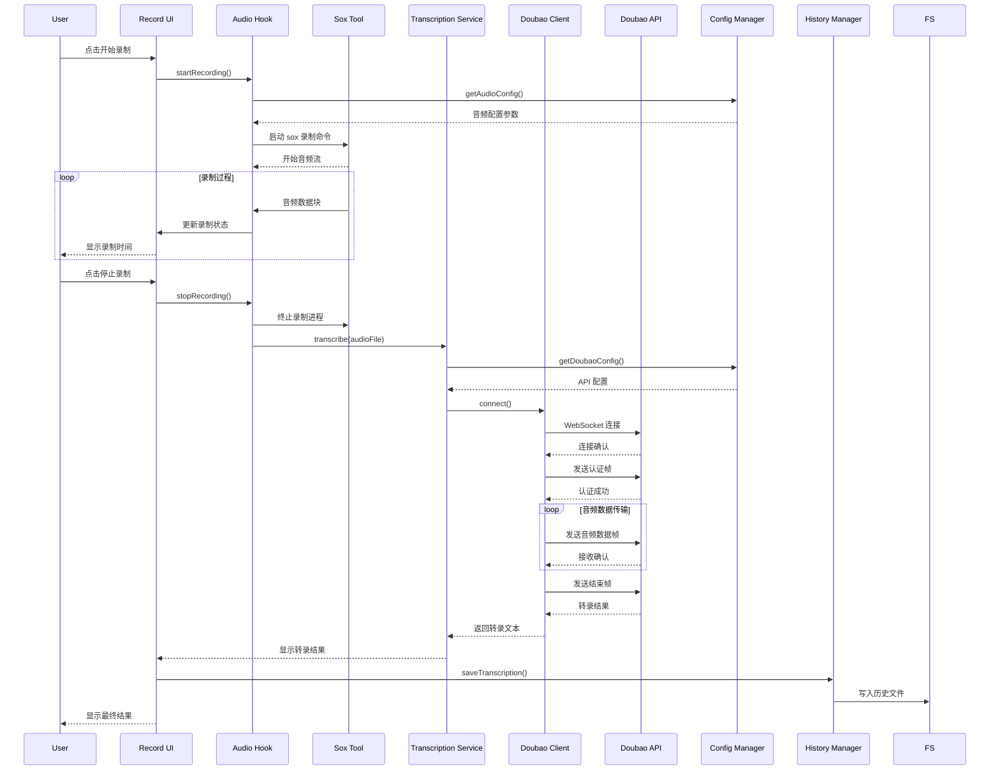
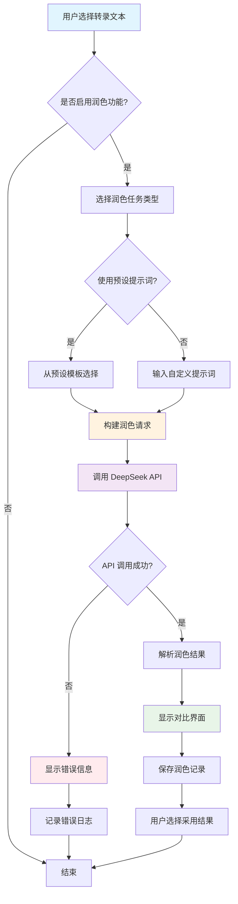
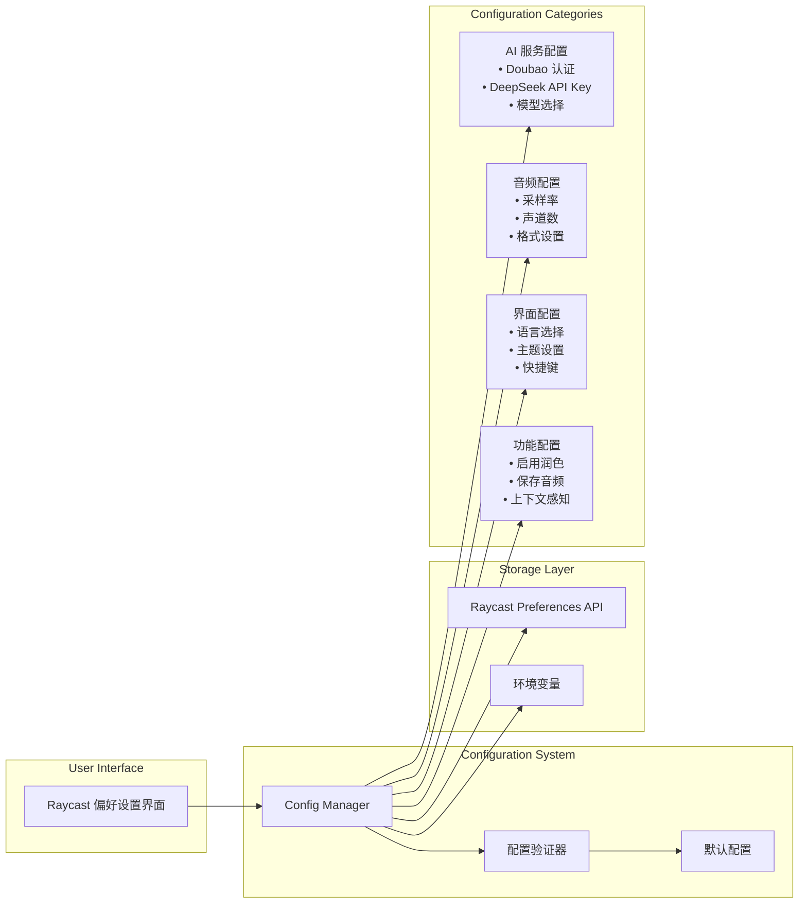
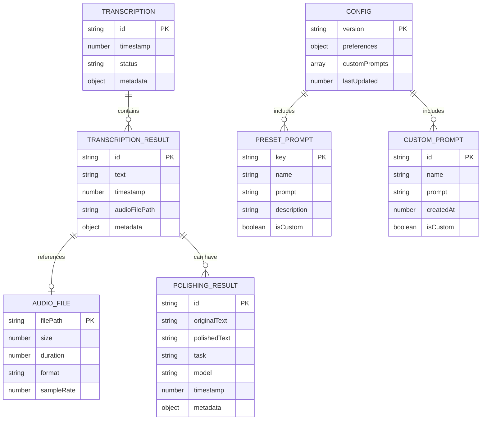

# 语音转文本插件详细设计文档

## 项目概述

这是一个为 Raycast 平台开发的语音转文本插件，支持多种 AI 服务提供商（目前主要支持豆包 Doubao），具备音频录制、实时转录、历史管理、文本润色等功能。插件采用现代化的 TypeScript + React 技术栈，遵循 Raycast 扩展开发规范。

### 核心特性
- 🎙️ 高质量音频录制（16kHz，16位，单声道）
- 🔄 实时语音转文本（支持豆包 WebSocket 流式 API）
- 🌐 多语言支持（自动检测 + 11种语言）
- ✨ AI 文本润色（基于 DeepSeek API）
- 📝 转录历史管理
- 🔧 丰富的配置选项
- 🐛 内置调试日志系统

## 整体架构

### 1. 架构分层

```
┌─────────────────────────┐
│    Raycast UI Layer     │ ← React 组件层
├─────────────────────────┤
│   Business Logic Layer  │ ← 业务逻辑层
├─────────────────────────┤
│    Service Layer        │ ← AI 服务集成层
├─────────────────────────┤
│    Utility Layer        │ ← 工具函数层
├─────────────────────────┤
│   System Integration    │ ← 系统集成层
└─────────────────────────┘
```

### 2. 核心模块组织

#### 用户界面层 (`src/`)
- `record-transcription.tsx` - 主录制界面
- `transcription-history.tsx` - 历史记录管理
- `view-logs.tsx` - 调试日志查看器

#### 业务逻辑层 (`src/hooks/`)
- `useAudioRecorder.ts` - 音频录制业务逻辑

#### 服务集成层 (`src/utils/ai/`)
- `transcription.ts` - 转录服务协调器
- `doubao-client.ts` - 豆包 WebSocket 客户端
- `deepseek-client.ts` - DeepSeek API 客户端

#### 工具层 (`src/utils/`)
- `config.ts` - 配置管理
- `history.ts` - 历史记录管理
- `logger.ts` - 结构化日志系统
- `formatting.ts` - 文本格式化工具
- `prompt-manager.ts` - 提示词管理

#### 系统集成层 (`src/utils/audio/`)
- `audio.ts` - 音频处理工具

## 详细模块设计

### 音频录制系统

#### 录制参数配置
```typescript
export const AUDIO_CONFIG = {
  SAMPLE_RATE: 16000,    // 采样率
  CHANNELS: 1,           // 单声道
  BIT_DEPTH: 16,         // 16位深度
  FORMAT: "wav",         // WAV 格式
  CHUNK_SIZE: 1024,      // 数据块大小
  SEGMENT_DURATION: 200, // 分段时长（毫秒）
} as const;
```

#### Sox 命令行集成
使用 Sox 工具进行高质量音频录制：
```typescript
export const SOX_COMMAND = [
  "/opt/homebrew/bin/sox",
  "-q",                    // 静默模式
  "-t", "coreaudio",       // CoreAudio 输入
  "default",               // 默认音频设备
  "-b", "16",              // 16位深度
  "-c", "1",               // 单声道
  "-r", "16000",           // 16kHz 采样率
  "-e", "signed-integer",  // 有符号整数编码
  "-t", "wav",             // WAV 输出格式
] as const;
```

### AI 服务集成

#### 1. 豆包 (Doubao) WebSocket 客户端

**连接配置**
- WebSocket URL: `wss://openspeech.bytedance.com/api/v3/sauc/bigmodel_async`
- 协议: 二进制流式协议
- 认证: App ID + Access Token + Secret Key

**消息帧结构**
```typescript
interface DoubaoFrame {
  sequence: number;      // 帧序列号
  type: 'audio' | 'end'; // 帧类型
  data: Buffer;          // 音频数据
  timestamp: number;     // 时间戳
}
```

**连接生命周期**
1. 建立 WebSocket 连接
2. 发送认证帧
3. 流式发送音频数据帧
4. 发送结束帧
5. 接收转录结果
6. 关闭连接

#### 2. DeepSeek 文本润色客户端

**API 配置**
- 基础 URL: `https://api.deepseek.com/v1`
- 支持模型: `deepseek-chat`, `deepseek-coder`
- 认证: Bearer Token

**润色任务类型**
```typescript
export type TextProcessingTask = 
  | "润色"      // 基础润色
  | "改写"      // 重新表达
  | "纠错"      // 语法纠错
  | "翻译"      // 语言翻译
  | "扩写"      // 内容扩展
  | "缩写"      // 内容精简
  | "学术润色"; // 学术风格
```

### 配置管理系统

#### 配置接口设计
```typescript
export interface TranscriptionPreferences {
  // AI 服务配置
  aiProvider: "doubao";
  doubaoAppKey?: string;
  doubaoAccessToken?: string;
  doubaoSecretKey?: string;
  
  // DeepSeek 配置
  deepseekApiKey?: string;
  deepseekModel?: string;
  deepseekBaseUrl?: string;
  
  // 功能配置
  language?: string;
  enableContext?: boolean;
  enablePolishing?: boolean;
  
  // 润色配置
  polishPrompt?: string;
  polishingTask?: string;
  
  // 转录配置
  promptText?: string;
  userTerms?: string;
  saveAudioFiles?: boolean;
}
```

#### 预设提示词系统
支持 8 种预设润色风格：
- **通用润色**: 基础文本优化
- **技术文档**: 专业技术表达
- **商务正式**: 商业场合用语
- **学术论文**: 学术写作风格
- **轻松易懂**: 日常交流表达
- **正式礼貌**: 正式场合用语
- **精简版本**: 去除冗余表达
- **详细展开**: 丰富内容细节

### 数据存储系统

#### 历史记录结构
```typescript
export interface TranscriptionResult {
  text: string;              // 转录文本
  timestamp: number;         // 时间戳
  audioFilePath?: string;    // 音频文件路径
  metadata?: {
    provider?: string;       // AI 服务提供商
    model?: string;          // 使用的模型
    language?: string;       // 检测到的语言
    duration?: number;       // 录制时长
  };
}
```

#### 润色记录结构
```typescript
export interface PolishingResult {
  originalText: string;      // 原始文本
  polishedText: string;      // 润色后文本
  task: string;             // 润色任务类型
  model: string;            // 使用的模型
  timestamp: number;        // 处理时间
  metadata?: {
    temperature?: number;    // 模型温度参数
    maxTokens?: number;      // 最大令牌数
    usage?: {               // 使用统计
      promptTokens: number;
      completionTokens: number;
      totalTokens: number;
    };
  };
}
```

### 日志系统设计

#### 日志级别
- `DEBUG`: 详细调试信息
- `INFO`: 一般信息记录
- `WARN`: 警告信息
- `ERROR`: 错误信息

#### 日志格式
```typescript
interface LogEntry {
  timestamp: string;        // ISO 时间戳
  level: LogLevel;         // 日志级别
  message: string;         // 日志消息
  context?: any;           // 上下文数据
  error?: Error;           // 错误对象
}
```

#### 自动日志清理
- 启动时自动清理旧日志
- 防止日志文件过大
- 保留最近的调试信息

## 用户交互流程

### 1. 语音转录流程

```
用户点击录制 → 初始化音频录制 → 实时显示录制状态 → 
停止录制 → 调用 AI 转录服务 → 显示转录结果 → 
保存到历史记录 → 可选择进行文本润色
```

### 2. 文本润色流程

```
选择转录文本 → 选择润色任务类型 → 可选自定义提示词 → 
调用 DeepSeek API → 显示润色结果 → 对比原文和润色文本 → 
保存润色记录
```

### 3. 历史管理流程

```
查看历史列表 → 搜索/筛选记录 → 查看详细内容 → 
复制文本 → 重新润色 → 导出记录 → 删除记录
```

## 错误处理策略

### 1. 音频录制错误
- Sox 命令不存在或失败
- 音频设备权限问题
- 磁盘空间不足

### 2. AI 服务错误
- 网络连接问题
- API 认证失败
- 服务配额超限
- 服务不可用

### 3. 用户界面错误
- 配置参数无效
- 文件读写权限问题
- 内存不足

### 错误恢复机制
- 自动重试机制
- 降级服务选择
- 用户友好的错误提示
- 详细的错误日志记录

## 性能优化

### 1. 音频处理优化
- 流式音频处理，避免大文件加载
- 音频文件自动清理，节省存储空间
- 合理的音频参数配置，平衡质量和性能

### 2. AI 服务优化
- WebSocket 连接复用
- 请求超时控制
- 结果缓存机制

### 3. UI 响应优化
- 异步操作避免界面阻塞
- 加载状态指示
- 进度条显示

## 安全考虑

### 1. 敏感信息保护
- API 密钥加密存储
- 本地音频文件安全清理
- 网络传输加密

### 2. 权限控制
- 音频录制权限申请
- 文件系统访问权限
- 网络访问权限

### 3. 数据隐私
- 音频数据本地处理
- 可选的音频文件保存
- 用户数据不上传云端

## 扩展性设计

### 1. AI 服务扩展
- 插件化的 AI 服务架构
- 统一的服务接口定义
- 简化新服务集成流程

### 2. 语言支持扩展
- 可配置的语言列表
- 本地化资源管理
- 多语言界面支持

### 3. 功能模块扩展
- 组件化的功能设计
- 松耦合的模块架构
- 可插拔的功能组件

## 开发和测试

### 开发环境
- Node.js + TypeScript
- React + Raycast API
- ESLint + Prettier 代码规范

### 测试策略
- 手动测试为主
- 单独的 API 测试脚本
- 内置的调试日志系统

### 部署发布
- Raycast Store 发布流程
- 版本管理和更新策略
- 用户反馈收集机制

## 架构图表

### 1. 整体系统架构图



### 2. 语音转录数据流图



### 3. 文本润色流程图



### 4. 配置管理架构图



### 5. 错误处理和日志系统图

```mermaid
graph TD
    subgraph "Error Sources"
        AUDIO_ERR[音频录制错误<br/>• Sox 命令失败<br/>• 设备权限<br/>• 磁盘空间]
        API_ERR[API 服务错误<br/>• 网络连接<br/>• 认证失败<br/>• 配额超限]
        CONFIG_ERR[配置错误<br/>• 参数无效<br/>• 文件权限<br/>• 环境问题]
    end
    
    subgraph "Error Handling"
        DETECTOR[错误检测器]
        CLASSIFIER[错误分类器]
        HANDLER[错误处理器]
    end
    
    subgraph "Recovery Strategies"
        RETRY[重试机制]
        FALLBACK[降级服务]
        USER_NOTIFY[用户通知]
    end
    
    subgraph "Logging System"
        LOGGER[结构化日志器]
        LOG_LEVELS[日志级别<br/>DEBUG|INFO|WARN|ERROR]
        LOG_FILE[日志文件<br/>speech-to-text-debug.log]
        LOG_VIEWER[日志查看器<br/>view-logs.tsx]
    end
    
    AUDIO_ERR --> DETECTOR
    API_ERR --> DETECTOR
    CONFIG_ERR --> DETECTOR
    
    DETECTOR --> CLASSIFIER
    CLASSIFIER --> HANDLER
    
    HANDLER --> RETRY
    HANDLER --> FALLBACK
    HANDLER --> USER_NOTIFY
    
    DETECTOR --> LOGGER
    CLASSIFIER --> LOGGER
    HANDLER --> LOGGER
    
    LOGGER --> LOG_LEVELS
    LOGGER --> LOG_FILE
    LOG_FILE --> LOG_VIEWER
```

### 6. 数据存储和历史管理图



这些图表全面展示了插件的架构设计、数据流、错误处理和存储结构，为开发和维护提供了清晰的技术指导。